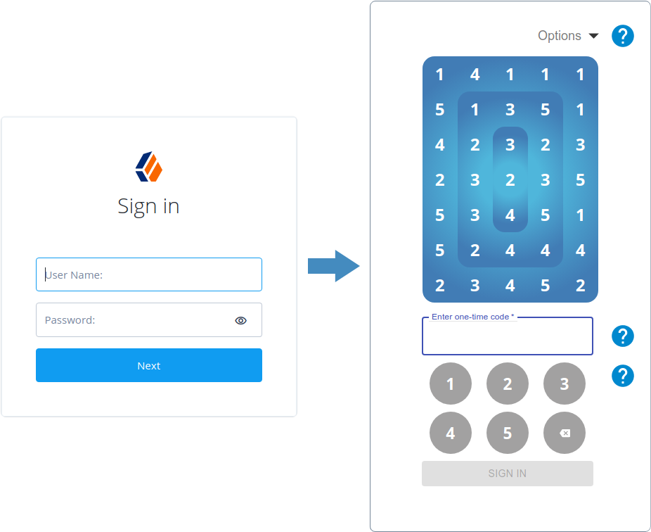
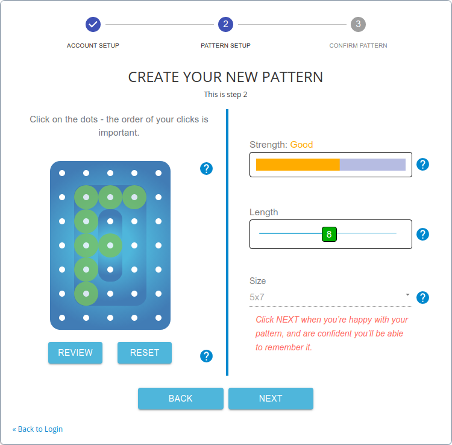
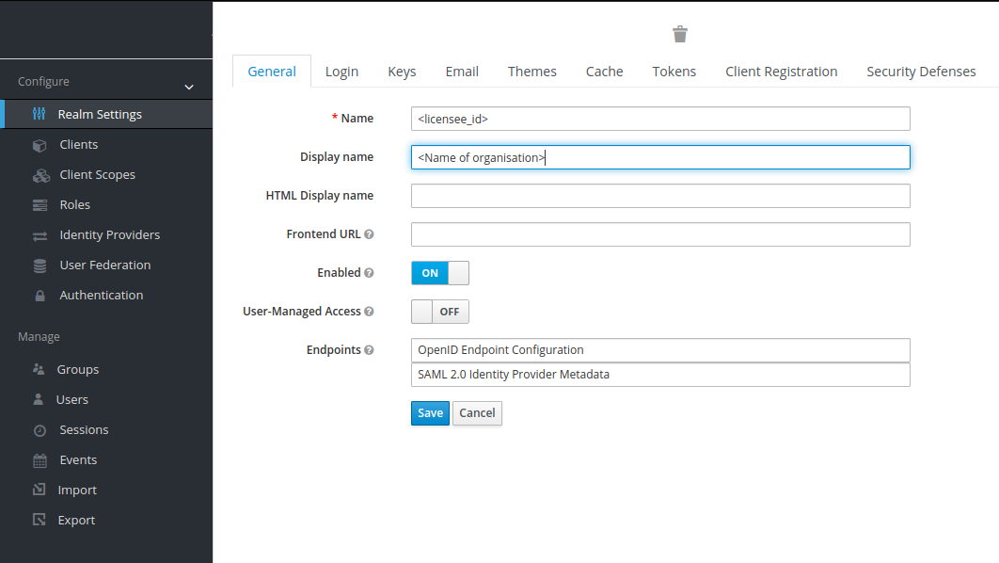
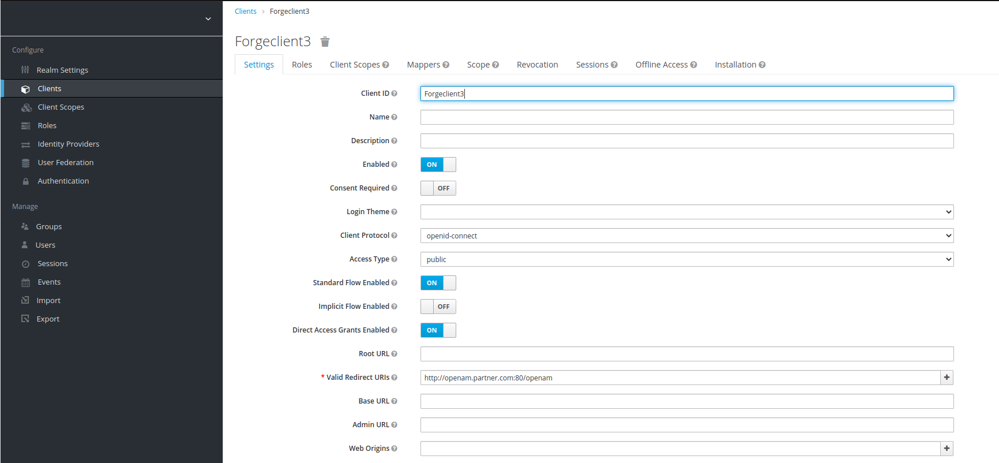
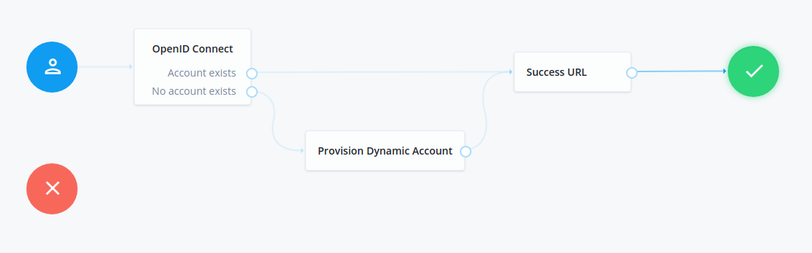
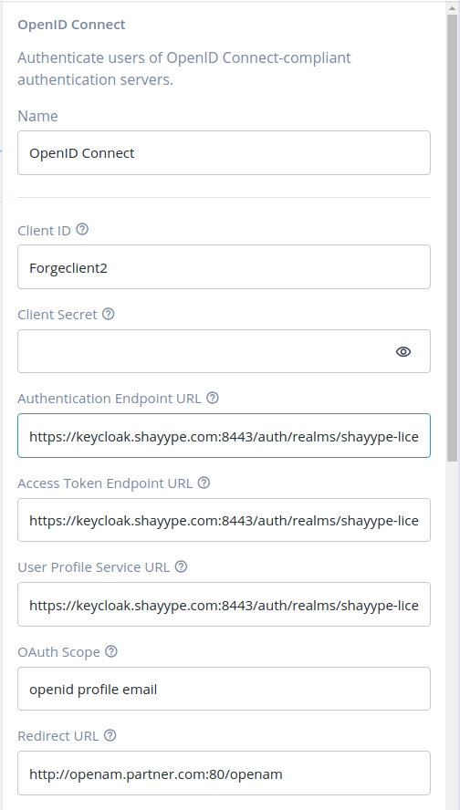
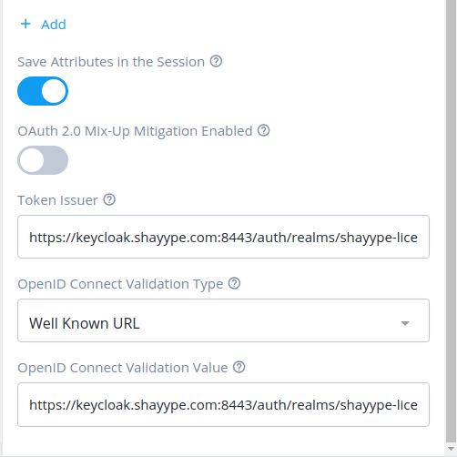

# Shayype

Shayype offers a revolutionary knowledge-factor authentication method using easy-to-remember patterns to extract one-time codes from a grid.

The benefits of Shayype are:
1. A device is not needed, eliminating technology frustration.
2. The user's secret is a memorable pattern, making it much easier to remember than a string of characters. 
3. The user never reveals their secret, making it resistant to keylogging and shoulder surfing attacks.  
4. The one-time code is dynamically encrypted, protecting communications from man-in-the-middle attacks.
5. The user's secret is not stored anywhere, meaning it cannot be stolen.

## Getting Started

Before you begin, you will need to create a Shayype account and request a cloud licence. Please contact us at sales@shayype.com for assistance or for more information.

For assistance with technical issues, please contact support@shayype.com.

## Shayype Overview

Shayype can be used to enhance or replace existing fixed passwords and 2-factor/2-step authentication.

The user will be presented with the Shayype grid and asked to use their pattern to read off the numbers in the correct order. This is their one-time code.

Users that are migrating to Shayype will be required to register a pattern. Here they will be invited to click between 4 and 12 cells to create (or ‘draw’) their pattern.

## Configuring the ForgeRock Authenticator

### Adding ForgeRock as a Client

1. Sign in to the Shayype Admin Console at https://admin.shayype.com

1.1 Select the 'General' (tab as shown below) to display your realm name (licensee_id) and display name. Find the link adjacent to 'Endpoints' and select 'OpenID Endpoint Configuration'.

 
This will display the configuration for your protocol endpoints to be inserted into the ForgeRock authentication tree.
The endpoint data will look similar to the below:

{"issuer":"https://keycloak.shayype.com:8443/auth/realms/shayype-licensee-id","authorization_endpoint":"https://keycloak.shayype.com:8443/auth/realms/shayype-licensee-id/protocol/openid-connect/auth","token_endpoint":"https://keycloak.shayype.com:8443/auth/realms/shayype-licensee-id/protocol/openid-connect/token","token_introspection_endpoint":"https://keycloak.shayype.com:8443/auth/realms/shayype-licensee-id/protocol/openid-connect/token/introspect","userinfo_endpoint":"https://keycloak.shayype.com:8443/auth/realms/shayype-licensee-id/protocol/openid-connect/userinfo","end_session_endpoint":"https://keycloak.shayype.com:8443/auth/realms/shayype-licensee-id/protocol/openid-connect/logout","jwks_uri":"https://keycloak.shayype.com:8443/auth/realms/shayype-licensee-id/protocol/openid-connect/certs","check_session_iframe":"https://keycloak.shayype.com:8443/auth/realms/shayype-licensee-id/protocol/openid-connect/login-status-iframe.html","grant_types_supported":["authorization_code","implicit","refresh_token","password","client_credentials"],"response_types_supported":["code","none","id_token","token","id_token token","code id_token","code token","code id_token token"],"subject_types_supported":["public","pairwise"],"id_token_signing_alg_values_supported":["PS384","ES384","RS384","HS256","HS512","ES256","RS256","HS384","ES512","PS256","PS512","RS512"],"id_token_encryption_alg_values_supported":["RSA-OAEP","RSA1_5"],"id_token_encryption_enc_values_supported":["A128GCM","A128CBC-HS256"],"userinfo_signing_alg_values_supported":["PS384","ES384","RS384","HS256","HS512","ES256","RS256","HS384","ES512","PS256","PS512","RS512","none"],"request_object_signing_alg_values_supported":["PS384","ES384","RS384","HS256","HS512","ES256","RS256","HS384","ES512","PS256","PS512","RS512","none"],"response_modes_supported":["query","fragment","form_post"],"registration_endpoint":"https://keycloak.shayype.com:8443/auth/realms/shayype-licensee-id/clients-registrations/openid-connect","token_endpoint_auth_methods_supported":["private_key_jwt","client_secret_basic","client_secret_post","tls_client_auth","client_secret_jwt"],"token_endpoint_auth_signing_alg_values_supported":["PS384","ES384","RS384","HS256","HS512","ES256","RS256","HS384","ES512","PS256","PS512","RS512"],"claims_supported":["aud","sub","iss","auth_time","name","given_name","family_name","preferred_username","email","acr"],"claim_types_supported":["normal"],"claims_parameter_supported":false,"scopes_supported":["openid","address","email","microprofile-jwt","offline_access","phone","profile","roles","web-origins"],"request_parameter_supported":true,"request_uri_parameter_supported":true,"code_challenge_methods_supported":["plain","S256"],"tls_client_certificate_bound_access_tokens":true,"introspection_endpoint":"https://keycloak.shayype.com:8443/auth/realms/shayype-licensee-id/protocol/openid-connect/token/introspect"}

1.2 Copy this data to your clipboard / notepad as you will need it to configure the ForgeRock Federation OpenID Connect node.

2. Create a new Shayype Client

2.1 Select 'Clients' under the 'Configure' menu on the left hand side. This will display all registered Shayype clients.
Click the 'Create' button on the right hand side.

2.2 Assign a client ID for this client. For example 'Forgeclient3' as shown below:

2.3 Enter the Client Secret previously saved when you created the client on Keycloak.

2.4 Enter the 'Valid Redirect URI' for successful login or logout. For example 
http://openam.partner.com:80/openam
.

2.5 Set 'Access Type' to 'confidential'

2.6 Save the client settings.

2.7 Select the 'Credentials' tab. then copy the Secret to your clibboard / notepad to be added to the OpenID Connect node in the ForgeRock Authentication tree.

3. Sign in to the ForgeRock OpenAM System Platform Admin to create an authentication tree as below:

3.1 From the dashboard, select 'Journeys' from the left hand side.

3.2 Add a new journey by clicking the button '+ New journey' at the top.

3.3 Under the Nodes section, select FEDERATION, then drag 'OpenID Connect' to the right hand pane.

Connect the User Journey start icon to the OpenID Connect node

3.4 Click on the openID Connect node to open the configuration form: 

3.5 Client ID: enter the name you entered in 2.2 when creating a client on Keycloak.

3.6 Find the following parameters from the endpoint configuration saved in 1.1

"authorization_endpoint":"https://keycloak.shayype.com:8443/auth/realms/shayype-licensee-id/protocol/openid-connect/auth"

Copy and paste the endpoint to "Authentication Endpoint URL"

"token_endpoint":"https://keycloak.shayype.com:8443/auth/realms/shayype-licensee-id/protocol/openid-connect/token"

Copy and paste the endpoint to "Access Token Endpoint URL"

"userinfo_endpoint":"https://keycloak.shayype.com:8443/auth/realms/shayype-licensee-id/protocol/openid-connect/userinfo"

Copy and paste the endpoint to "Profile Service URL"

"issuer":"https://keycloak.shayype.com:8443/auth/realms/shayype-licensee-id"

Copy and paste the endpoint to "Token Issuer"

Use the issuer endpoint and append: .well-known/openid-configuration

"https://keycloak.shayype.com:8443/auth/realms/shayype-licensee-id/.well-known/openid-configuration"

Copy and paste the endpoint to "OpenID Connect Validation Value"

3.7 Redirect URL
Enter the redirect URL 

3.8 Provision Dynamic Account if user does not exist

Under the Nodes section, select FEDERATION, then drag 'Provision Dynamic Account' to the right hand pane.
Link the OpenID Connect outcome 'No account exists' to the 'Provision Dynamic Account' node

3.9 Add a Success URL

Under the Nodes section, select UTILITIES, then drag 'Success URL' to the right hand pane.
Link the OpenID Conect outcome Account exists to the 'Success URL' node
Link the Provision Dynamic Account outcome to the 'Success URL' node 
Link the success URL outcome to the green tick
